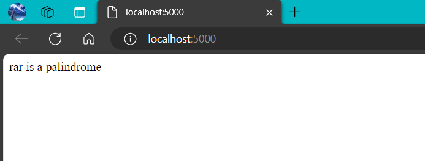
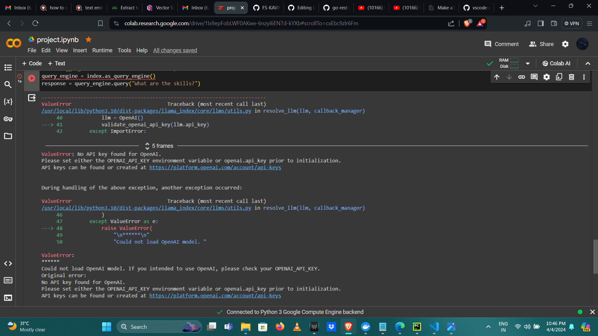

# Summary Of The Interview 

## Round - 1

The questions asked in this round are as follows:

- Explain the uses of numpy library
- What is the use of panda library
- Explain oops concepts in python
- Explain Exception Handling in python
- Create a program to check if the given string is palindrome using class
- Create a python program with Student class with data members such as name, age and DOB

## Round - 2

The given task in this round is to run the palindrome program with python flask framework and create a docker image and set it to run on Port 5000 with it's library requirements and then create a container and run it such that the result of palindrome program is being displayed on localhost.

The following is the dockerfile script used to create the image 
``` Dockerfile
FROM python:3.12-slim

EXPOSE 5000


ENV PYTHONDONTWRITEBYTECODE=1

ENV PYTHONUNBUFFERED=1

COPY requirements.txt .
RUN python -m pip install -r requirements.txt

WORKDIR /app
COPY . /app


RUN adduser -u 5678 --disabled-password --gecos "" appuser && chown -R appuser /app
USER appuser


CMD ["gunicorn", "--bind", "0.0.0.0:5000", "app:app"]
```
The final output of the project is shown below 



## Round - 3

In this project i have created a text embedding of my resume without the use of vector database in llama index using CohereAI and produces output for the given query, 
this is done by reffering the llama-index docs - https://docs.llamaindex.ai/en/stable/examples/embeddings/cohereai/

Also i have used qdrant vector database to store and retrieve the embedded text and pass the index to llamaindex for the same but failed due to the need
of OpenAI. The docs referred is - https://docs.llamaindex.ai/en/stable/examples/vector_stores/QdrantIndexDemo/
The following is the error message returned when executed




 


